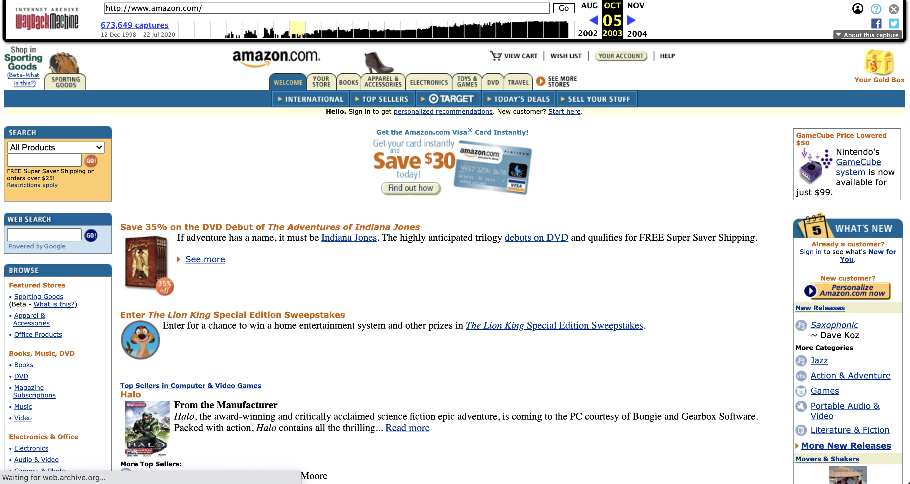
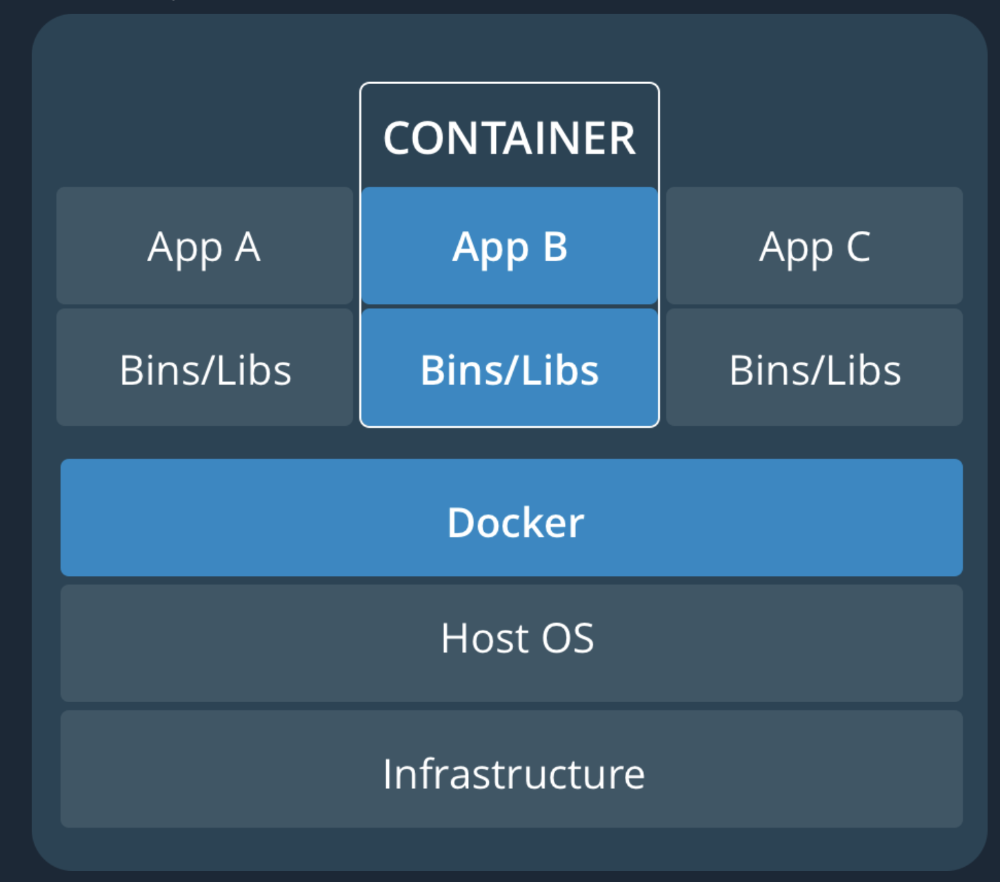
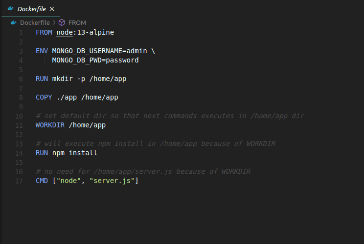
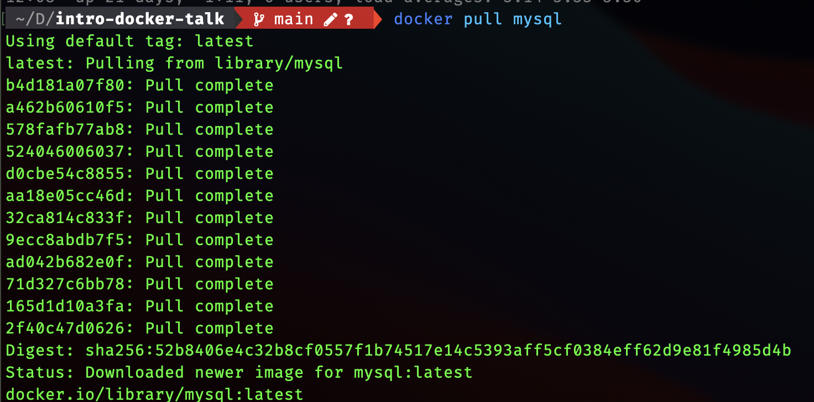

class: center, middle

# An introduction to containerized software development

Exploring the history of virtualization.

???
This is going to provide a high level of the technology behind
how docker works as well as a little hisotry of the industry
pressures that has pushed containers into the forefreont for lots of developers.

Containers are a technology popularized by Docker that builds upon the last 60 years of work on virtualization technology.

---

class: left

# Introductions

My name is Michael Kalish and I've been a software programmer for the last eight years; over my time I've gotten to work at some great companies but I'm currently a lead engineer at [Curiosity Media](https://www.curiositymedia.com/). We're the team behind products like [SpanishDict](https://www.spanishdict.com/) and [Fluencia](https://www.fluencia.com/).

[Github](https://github.com/mkalish)

.twoCol[.image[].image[]]

---

# Agenda

- Where we are today
- Where we were
- What containers solved

???
What is state of developing web applications and virtualization now and how did we get here

---

class: center,middle

Feel free to ask questions in the chat, which I'll periodically check. I'll also occasionally ask a few
questions, and feel free to use the raise hand feature.

---

# Where we are today

.bigImage[]

???
A great thing about software engineering is that there are always new things to learn. The downside
is that there is so many tools, applications, compilers, operating systems developers often
face the problem of being confident that the work that they do on their own computers will work the same
way when there work is published as an app or a website.

Famous words of every developer "It worked on my machine."

---

# IBM Pre-1963

.bigImage[]

???
The original makers of the computer was IBM. Think those huge rooms with floor to ceiling computers.

In fact, the only game in town. They offered computers that you could come in and rent; you would get to feed your program
in one side walk around to the other and it would print out the results. And it worked great.

Downside was that it took a long time to write "programs" that could be executed and only one program could be run at a time meaning no interaction. Insert the program, press play and wait for the results.

---

# MIT - 1963

.twoCol[.bigImage[]]

???
The beatles release their first single in the USA.

---

## DARPA(Defense Advanced Research Projects Agency) gives MIT a grant

.twoCol[]
???
DARPA, also responsible for later helping to develop the internet, gives a $2 million grant
to MIT ($16 million in today's money) for research into Operating Systems, Artificial Intelligence, and Computational Theory.
In order to run the new experiments, MIT puts out a bid to a bunch of vendors including IBM and GE, to build a new set
of computers capabale of running multiple programs at once with user interaction.

Thinking back a few slides this is a very different paradigm than what IBM had available

And of course...

---

class: center

# And of course, the bid goes to...

--

# GE?

.twoCol[]

???
IBM says no thanks, are systems are the the most perfect systems and don't to be
changed. Besides, who else would ever want to buy it?

---

# Fast Forward - 1968

.twoCol[.bigImage[]]

???
Apollo 8 launches and humans orbit the moon for the first time

---

class: center

# Time Sharing 1968-1972

???
Turns out, lots of people would want it based on the early success that GE had, which serves as a wakeup call for IBM and theur first
system became available in 1968 and finally commercially available in 1972.

The way it was worked that the system would let different users or processes take turns using the memory and computing
power of the hardware, things like RAM and CPU. The sharing happens so quickly that a person using would not be able to tell and it would appear as if it was all happening simultaneously.

---

class: center

# Unix - 1972

.twoCol[]

???
Couple iterations later more on the idea and UNIX is born. UNIX built on the same idea and abstracted it further.
If we can let users share physical hard drives, RAM and CPUs, we can let the share things like folders and documents.
It was virtualization on the user level.

---

# Jumping forward a couple decades - 1994

.twoCol[]

???
Linux 1.0.0 comes out on March 14th 1994

---

# JVM - 1994 - 1995

.twoCol[]

???

The status quo worked really welly for a bunch of years. However, software still wasn't super portable because even things as simple as folders neededto be built specially for each operating system, in a process know an compiling. As more operating
systems were joing the market this became complicated and compiling takes a long time.

A company calls Sun thinks they can do better and creates the Java Virtual Machine which serves as an intermediary between an
application written in Java and the operating system. Now developers could compile the one time and anyone with Java installed
could run it.

"java runs on 3 billion devices"

---

# Closer to today - 2001

.twoCol[.bigImage[]]
???
At the same time application developers were working to make applications more portable,
OS developers were doing the same. At the tiem, VMWare is the a main player in virtualization with two products
Type-2 Hypervisor
Type-1 Hypervisor

---

# AWS - 2002

.bigImage[]

???
This is what it looked like in 2002

---

# A problem becomes a solution and the cloud is born -2006

.twoCol[.bigImage[]]

???
Despite their success, Amazon still had a problem; theyneeded to have capactiy to serve Christmas the peak, but
served far fewer customers in March. The solution lets sell it! And thus Amazon Web Services was born offering
S3 (simple storage service) for hard drive space and EC2 (elastic compute cloud) for virtual computers.

---

# Modern Times - 2008

.twoCol[.bigImage[].bigImage[]]

???

---

# Javascript takes off - 2008

.twoCol[.bigImage[]]

???
The internet is a Thing at this point and javascript is the only language that runs everywhere and
despite all of it quirks it serves as fast and convenient language for creating web applications.

---

class: center

# DevOp Conference - 2009

In Ghent, Belgium
.twoCol[.bigImage[]]

???
Ghent Belgium is where first dev ops day occurs. Operations used to largely mean the job of maintaining the OS
and additional resources that modern applications like a database.
Fun fact: Ghent used to be the second largest city in Europe (1300-1400s), famous for its wool
This is city sanctioned graffitin section.

Before this, Operations and Developers were tightly split into their own areas of responsiblity.

---

class: center

# Five years late - 2013

Pope Francis joins twitter

.twoCol[]

---

# Docker Simple and convenient - 2013

.twoCol[]

???
First official release of docker and the ideas of containers. The premise was that it would solve all the problems that current virtualization technology currently did, but with a substantially smaller foot print.

---

# Simple - How it works

.twoCol[]

???
Removes the hypervisor, and packages the OS and application into one

---

# Another Diagram

.twoCol[.bigImage[]]

---

class: center

# Covenient

.twoCol[.bigImage[]]
???
Back in 2006, people were entirely responsible for managing and executing these commands by hand, sometimes by memory which lead to inconsitent results. Docker provides a convenient syntax to write them down (though there are other tools that do this successfully) and importantly, the capability of running them ahead time so that the commands are never ran in the incorrect order.

And because we have saved so much space by eliminating guest OS, they are small enough that they can be shared on public repositories.

---

class: center

# Download a database

.twoCol[.bigImage[]]

---

# Great for the little guy (and Amazon gets in the game) - Today

- AWS offers Elastic Container service for running docker containers on there computers as well
  as integrating with there other services like S3 and databases
- goes a long way in reducing the maintenance cost for applications and enabling more flexible and comprehensive devolpment

---

# Questions

---

# Sources

https://www.idkrtm.com/history-of-virtualization/
https://en.wikipedia.org/wiki/Amazon_Web_Services
